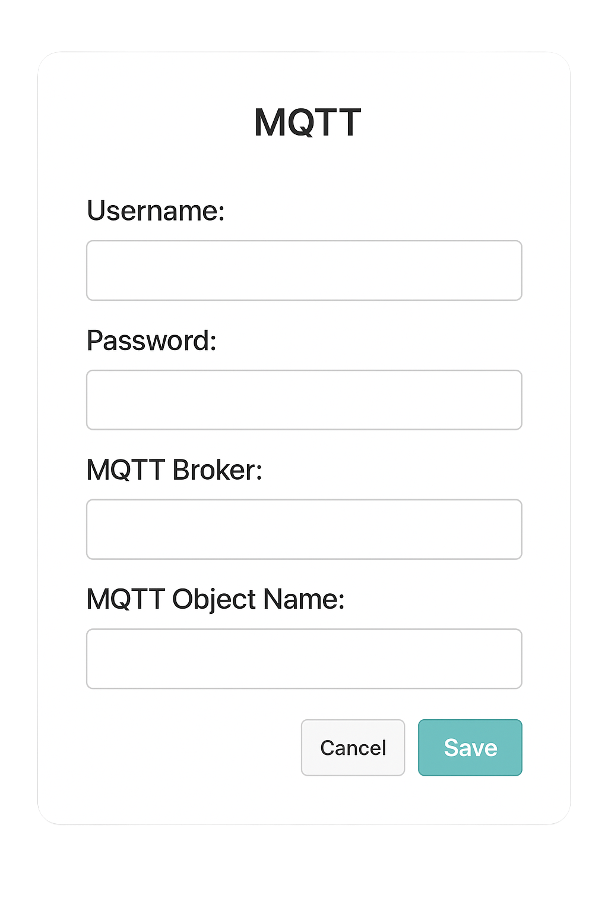

# Intro to Lilota

Lilota is an open source embedded systems firmware for microcontrollers such as the ESP32, ESP8266, and Arduino Pico to be used in an IoT home automation system. 

A microcontroller flashed with Lilota uses [TCL](https://www.tcl-lang.org/about/language.html) files to interface with connected hardware.  
(NCI) \= Not currently Implemented

# Prerequisites

1. Supported Microcontroller: ESP32, ESP8266, Arduino Pico  
   1. For microcontroller boards without built in serial programmers, you will also need a separate serial programmer  
2. Computer with Linux, MacOS, or Windows  
3. USB data cable (Some are power delivery only)  
4. (NCI) Prebuilt firmware (pretend there is a link to download prebuilt versions) or [build your own](https://github.com/COMPAS-Lab/lilota)  
   1. I’m hoping that there will be at least one version where you don’t have to install your own prerequisite software and only need to install the Lilota IDE

# (NCI) Setup \- IDE method

1. Install the lilota IDE (We should make this windows compatible(most people use windows after all))  
2. Use IDE to flash built files onto esp/pico  
3. After flashing, a gui menu will pop up to configure wifi, mqtt, etc (this menu can be brought up later through the IDE  
4. Everything will have been setup and all you need to do is create files which can then be flashed onto the board

(I can’t exactly describe anything else because the IDE is broken :(

# Setup \- Terminal method

1. Follow the [contributing.md file](https://github.com/COMPAS-Lab/lilota/blob/main/CONTRIBUTING.md)

# Useage

To start, create a new TCL file 

## Comments:

To declare a line or a part of a line as a comment, put a “\#” in front of it  

### Example:
```
#Ex1: 
puts 5; #prints out a 5

#Ex2:
#The line above prints out a 5
```
## Semicolon:

Declares the end of a line and allows for another action to be called. Can be replaced by a new line  

### Example:
```
#Ex1:
puts 5; #prints out a 5

#Ex2:
puts 5; puts 100; #prints out a 5 then prints out a 100 in the next line
```

## source:

Runs another TCL script within the current TCL environment

### Example:
```
#Ex1: (Currently in the terminal)
source something.tcl

#Ex2: (Currently running something.tcl)
puts "something"
source somethingElse.tcl; #Will now run somethingElse.tcl which will print out "something else"

#Ex3:
source motors.tcl; #initalize the functions necessary to run motor pwm
move $FORWARD 100
```

## puts:

Prints out values or commands  
Syntax: puts ?-nonewline? value A/N: the nonewline flag does not work  

### Example
```
#Ex1: 
puts 5

#Ex2:
puts “hello world”

#Ex3: 
puts “h”
puts -nonewline “i”

#Ex4:
set num 5
puts "num's value is $num"

#Ex5:
set num 5  
puts "num - 4 = [expr $num - 4]"
```

## set: 

creates a variable under the variableName if variableName does not exist and assigns value to it

### How to use:

Syntax: set variableName *value*  

#### Example:
```
#Ex1:
set num 5

#Ex2:
set led [gpio -mode out 12]; #led gets assigned to a refrence of a gpio object with pin 12 and mode "out"
```

## Dollar sign($):

Accesses the value of a variable  

### Example:
```
#Ex1:
set hi 5  
puts $hi; \#prints out 5

#Ex2:
set led [gpio -mode out 12]; #led holds a refrence to a gpio object
$led on; #calls the refrence to the led gpio object to use its methods
```

## Square Brackets([]):

Calls the interpreter recursively

### Example:
```
#Ex1:
puts [expr 3 * 2]

#Ex2:
set led [gpio -mode out 12]; #gpio function is called first and returns a refrence to a gpio object with pin 12 and mode "out"
```

## expr:

Evaluates and returns given expression

### Example:
```
#Ex1:
set a 3
set b 2
set c [expr $a + $b]

#Ex2:
puts [4 * 3 / (2 * 3)]; #prints 2
```

## incr:

Increments a variable by a selected value  
Syntax: incr variableName *amount*  
- If amount is not provided, it defaults to 1

### Example:
```
#Ex1:
incr num; #this increments num by 1

#Ex2:
incr num 3; #this increments num by 3
```
## decr:

Decrements a variable by a selected value  
Syntax: decr variableName *amount* 
- If amount is not provided, it defaults to 1

### Example:
```
#Ex1:
decr num; #this decrements num by 1

#Ex2:
decr num 4; #this decrements num by 4
```


# Structures and Objects:

Structures take on the same syntax as functions that return a refrence back to create objects

### gpio:

Syntax: \[gpio \-mode *In/Out* *pinNo*\]  

#### Example:
```
[gpio -mode in 12]
```
### pwm:

Syntax: \[pwm \-channel *channelNo* \-resolution *resolution* \-frequency *frequency* *pinNo*\]  

#### Example:
```
[pwm -channel 0 -resolution 18 -frequency 233 27]
```
### adc:

Syntax: \[adc \-bitwidth *bitwidth* \-attenuation *addenuation* *pinNo*\]  
ex : \[adc \-bitwidth 12 \-attenuation 0 6\]

### i2c:

Syntax: \[i2c -sda *sdaPin* -scl *sclPin* -freq *frequency*\]  

#### Example:
```
[i2c -sda 21 -scl 22 -freq 100000]
```

## after:

After a certain amount of time(ms), run what is inside of the after function call.  
If there is nothing inside of the function call, it pauses the thread that is currently running the code  
Syntax: after *time* {script}  
Syntax: after *time*  

#### Example:
```
Ex1:
after 500 {puts “hi”}

Ex2:
after 1000  
puts “bye”
```
## sleep:

Pauses the thread for a certain amount of time(s) 
Don’t use, use after  
Syntax: sleep *time*  
#### Example:
```
sleep 5; #sleeps for 5 seconds
```

## if statements:

If a condition is true, then do something if it isn't then do something else
Syntax: if {condition} {do this} elseif {condition} {do this} else {do this}  

#### Example:
```
if {[expr $num > 5]} {  
  puts big  
} elseif {[expr $num < 5 && $num >3]} {  
	puts med  
} else {  
	puts small  
}
```
## for loops:

For the condition provided, loop while also executing something before every next loop  
Syntax: for {set *variable* *value*} {*condition*} {*executedThing*} {*loopedCode*}  

### Example:
```
for {set i 0} {[expr $i < 11]} {incr i} { #prints out i from 0 to 10  
	puts $i  
}
```

## foreach loops:
For each value in an array, assign the value to the given variable and loop the inside code the by the length of the array
Syntax: foreach *loopingVariable* *arrayVariable* {*loopedCode*}  

### Example: 
```
set $myArray {"a" "b" "c" "d" "e" "f" "g" "h" "i" "j" "k" "l" "m" "n" "o" "p" "q" "r" "s" "t" "u" "v" "w" "x" "y" "z"}
foreach i $myArray {
	puts $i
}
```

## while loops:

While the condition provided is true, loop  
Syntax: while {*condition*} {loopedCode}  

### Example:
```
set j 0  
while {$j < 10} { #prints out i from 0 to 9 but excludes 6 and 7  
    puts $j  
    if {$j == 5} { incr j 2 }  
    incr j  
}
```
## gpio:

set `[gpio -mode in/Out pinNo]` to a variable to create an object  
Commands for gpio:

### set:

Set the level of a GPIO pin  
Syntax: *gpioObject* set *intValue*  

#### Example:
```
Ex1: 
set led [gpio -mode out 12]  
$led set 1; \#This will turn on the LED  
$led set 0; \#This will turn off the LED

Ex2:
[gpio -mode out 12] set 1; #this will set whatever is at gpio pin 1 to level 1
```
### change:

When there is a change in the state of the GPIO pin, run the callback  
Syntax: *gpioObject* change {callback}  

#### Example:
```
set button [gpio -mode in 5]  
set led [gpio -mode out 12]  
$button change { #when button is pressed, led on. When button is released, led off  
  global led  
  if { $value } {  # or [$this get]  
    $led on  
  } else {  
    $led off  
  }  
}
```
### get:

Returns the state of the GPIO pin  
Syntax: \[*gpioObject* get\]  

#### Example:
```
set led [gpio -mode out 12]
$led set 1  
puts [$led get]; #prints out 1 which is the state of the led
```
### on:

Sets the gpio pin to state 1  
Syntax: *gpioObject* on  

#### Example:
```
set led [gpio -mode out 12]  
$led on; #The led turns on
```
### off:

Sets the gpio pin to state 0  
Syntax: *gpioObject* off  

#### Example:
```
set led [gpio -mode out 12]  
$led on; #The led turns on  
$led off; #The led turns off
```
### (NCI) toggle:

if gpio pin state is 0, then set to 1, if state 1, set to 0  
Syntax: *gpioObject* toggle  

#### Example:
```
set led [gpio -mode out 12]
$led toggle; #The led turns on  
$led toggle; #The led turns off
```
### mode:

Sets the mode of the gpio pin to be either input or output  
Syntax: *gpioObject* mode *in/Out*  

#### Example:
```
set led [gpio 12]  
$led mode out
```
Alternatively you can set the mode during the gpio object creation:  
syntax: \[gpio \-mode in/Out pinNo\]  

#### Example:
```
set button [gpio -mode in 5]
```
### pulse:

Sets the state of a gpio pin to high for a specified amount of time(ms)  
Syntax: *gpioObject* pulse *time*  

#### Example:
```
set led [gpio -mode out 12]  
$led pulse 1000; #turns on the led for 1 second then turns it off
```
### onpulse:

when there is a pulse in the state of the gpio pin, run the callback function  
This was originally for the ultrasonic range finder  
syntax: *gpioObject* onpulse {callbackFunction}  
#### Example:
```
$button onpulse { #When doing this, makes sure to use a debounced button  
  global led  
  if {[$led get]} {  
    $led off
    puts "LED OFF"  
  } else {  
    $led on
    puts "LED ON"  
  }  
}
```
## pwm:

set \[pwm \-channel *channelNo* \-resolution *resolution* \-frequency *frequency* *pinNo*\] to a variable to create an object  
commands for pwm:

### duty:

Sets the duty cycle of the pwm signal using a double from 0 to 1  
Syntax: *pwmObject* duty *doubleValue*  
#### Example:
```
set buzzer [pwm -channel 3 -resolution 17 -frequency 587 27]  
$buzzer duty 0.5
```

### freq:

Sets the frequency of the pwm signal using integers.   
(NCI) If the frequency is outside of the current resolution, set the resolution to the one that will work with the frequency set  
syntax: *pwmObject* freq *intValue*  
#### Example:
```
set buzzer [pwm -channel 3 -resolution 17 -frequency 587 27]  
$buzzer duty 0.5  
after 1000
$buzzer freq 440  
(NCI)
set buzzer [pwm -channel 3 -resolution 17 -frequency 587 27]  
$buzzer duty 0.5  
after 1000  
$buzzer freq 294; #automatically switched from resolution 17 to 18 to support
```

### (NCI) res:

If automatically setting the resolution with the frequency is not feasable, let the user set the resolution of the pwm object without needing to replace the object with a new one of the new frequency  
syntax: *pqmObject* freq *intValue*  
#### Example:
```
set buzzer [pwm -channel 3 -resolution 17 -frequency 587 27]  
$buzzer duty 0.5  
after 1000  
$buzzer res 18  
$buzzer freq 294
```

## proc:

Creates a function that you can call in the future.  
Define syntax: proc *functionName* {parameters} {function}  
Call syntax: *functionName* *parameters*  
#### Example:
```
Ex1:
set led [gpio -mode out 12]  
proc cycleLED {times} {  
    global led  
    for {set i 0} {$i < $times} {incr i} {  
        $led on  
        after 500  
        $led off  
        after 500  
    }  
}  
cycleLED 5
```
#### Example 2:
```
set led [gpio -mode out 12]  
proc cycleLED {times time} {  
    global led  
    for {set i 0} {$i < $times} {incr i} {  
        $led on  
        after $time  
        $led off  
        after $time  
    }  
}  
cycleLED 5 500
```
#### Example 3:
```
set led [gpio -mode out 12]  
proc cycleLED {} {  
    global led  
    for {set i 0} {$i < 3} {incr i} {  
        $led on  
        after 400  
        $led off  
        after 400  
    }  
}  
cycleLED
```

### Default values

To set the default value of a proc parameter, use curly braces around the parameter and default value with   
syntax: {*parameter defaultValue*}  
While you can put parameters with default values in front of parameters without default values in the proc declaration, there is no point as you will have to declare the value for the parameter with default value.  
```
proc cycleLED { {times 5} time} {# there is no point for this order of declaration}
``` 
Rather, a more useful way of declaring this would be:  
```
proc cycleLED {time {times 5} } {#This way is much more functional as only need to input a value for time and not for times}
```
#### Example: 
```
ex: set led [gpio -mode out 12]  
proc cycleLED {times {time 500} } {  
    global led  
    for {set i 0} {$i < $times} {incr i} {  
        $led on  
        after $time  
        $led off  
        after $time  
    }  
}  
cycleLED 5  
cycleLED 1 1000  
cycleLED 2 3000
```

## i2c:

Aside from the creation/calling of the i2c object, using the syntax: \[i2c -sda *sdaPin* -scl *sclPin* -freq *frequency*\], each i2c device needs extra setup.  
While the extra setup can be done manually, example codes have been provided and are available for use  

### Access Examples through IDE:
To access i2c example code through the IDE, go to File->Examples->i2c Examples and choose your correct i2c part.  

### Access Examples through Terminal:
To access i2c example code through the terminal, go to the `/lilroot/examples/i2c_Examples/` directory  

### read:
Reads and returns the value from the i2c slave address  
syntax: *i2cObject* read *Address* *bytesToRead*

#### Example:
```
set readVal [$i2cDriver read $_chipAddress 1]
```

### scan:

### timeout:

### write:

## spi:

## adc:

## mqtt:

In order to monitor and send commands to the Lilota Device, MQTT can be used.  
You should be prompted to set up MQTT after Lilota was first flashed onto your microcontroller.  
If you didn't set it up then, go to Config->Wireless->MQTT and you will be prompted with the window to set up MQTT.  



The MQTT Object Name is the name of the object variable that you will call the MQTT object with.
